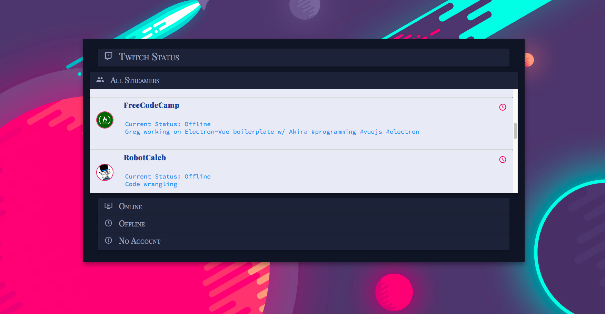

## Twitch Tv: A Free Code Camp Project

### Objectives:

* Use the Twitchtv JSON API

* Build a CodePen.io app that is functionally similar to <a href="https://codepen.io/FreeCodeCamp/full/Myvqmo/"> this. <a/>

#### Rules:

  <ol>
  <li>Don't look at the example project's code. Figure it out for yourself.</li>

  <li>Fulfill the below user stories. Use whichever libraries or APIs you need. Give it your own personal style.</li>
  </ol>

#### User Stories:

  <ul>
  <li> I can see whether Free Code Camp is currently streaming on Twitch.tv.</li>

  <li> I can click the status output and be sent directly to the Free Code Camp's Twitch.tv channel.</li>

  <li> If a Twitch user is currently streaming, I can see additional details about what they are streaming. </li>

  <li> I will see a placeholder notification if a streamer has closed their Twitch account (or the account never existed). You can verify this works by adding brunofin and comster404 to your array of Twitch streamers.</li>
  </ul>

Please visit the live project by clicking the image below

